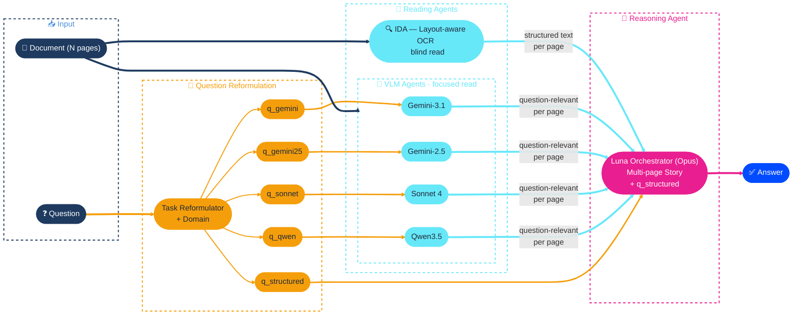
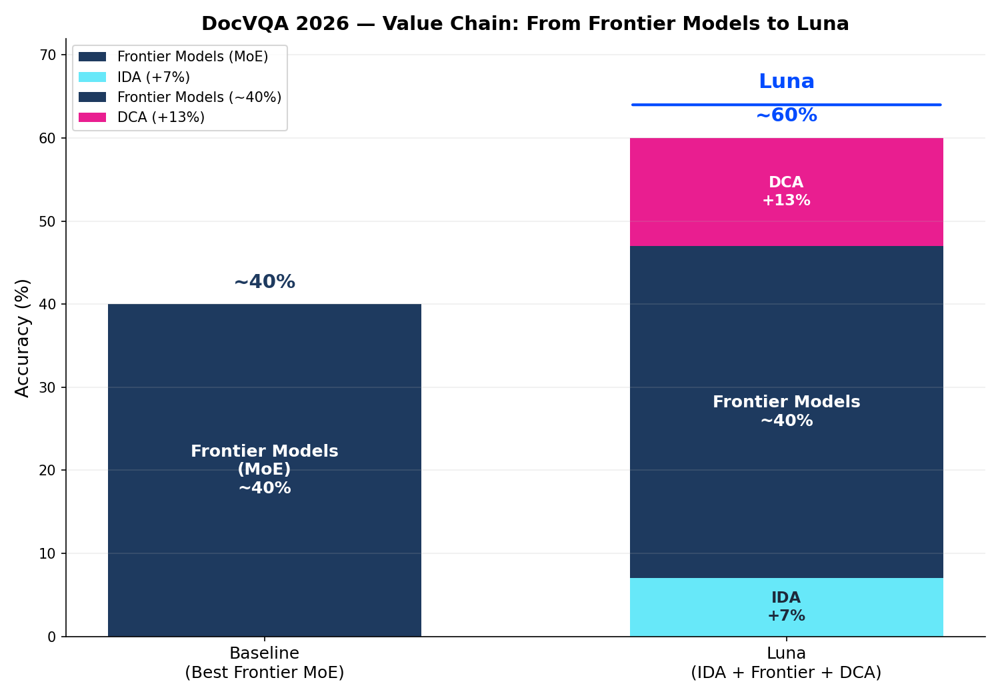

# Luna + IDA + Multi-Agent Reasoning Ensemble

**Author:** Welf Wustlich (CTO), [Planet AI](https://www.planet-ai.de), Rostock, Germany  
**Co-Authored by:** Luna — Cognitive AI Platform (Planet AI)  
**Competition:** DocVQA 2026 — Multimodal Reasoning over Documents in Multiple Domains (ICDAR 2026)  
**Category:** Over 35B parameters  
**Contact:** welf.wustlich@planet.de

---

## Abstract

We present **Luna + IDA + Multi-Agent Reasoning Ensemble**, a three-layered document
understanding system for the DocVQA 2026 competition. **Luna** is built on the Distributed
Cognitive Architecture (DCA), a framework that extends Foundation Models with capabilities
they lack in isolation: distributed reasoning across multiple perspectives, memory and context
management across long content, reflection for self-assessment, error and hallucination detection,
and convergent problem-solving that synthesizes conflicting evidence into a single robust answer.
Our approach combines (1) **Luna IDA**, a dedicated layout-aware document parser producing
structured Markdown, (2) **multi-perspective page reading** via independent VLMs (Gemini, Sonnet,
GPT, Qwen), each guided by model-adapted question reformulations, and (3) **agentic reasoning**
that resolves conflicts through domain-aware trust hierarchies and majority voting. By grounding
VLM outputs in precise OCR-extracted text and orchestrating convergence across all perspectives,
our system achieves robust performance across all eight document domains — from business reports
and scientific papers to comics and maps.

---

## 1. Introduction

Document Visual Question Answering (DocVQA) requires systems to reason over diverse document
types and extract precise answers from complex layouts. The DocVQA 2026 competition extends
this challenge to **eight heterogeneous domains** — business reports, scientific papers, slides,
posters, maps, comics, infographics, and engineering drawings — demanding both textual precision
and visual understanding.

No single model excels across all domains. OCR-based systems achieve near-perfect extraction on
text-heavy documents but fail on visually complex content like maps or comics. Conversely,
Vision-Language Models capture visual semantics but hallucinate numbers and confuse table
structures. Our key insight: **complementary perspectives, independently generated and
intelligently combined, outperform any single approach.**

**Luna** is a cognitive AI platform developed by [Planet AI](https://www.planet-ai.de), built on
the Distributed Cognitive Architecture (DCA). DCA starts from the observation that a foundation
model alone is not intelligent — it lacks persistent memory, executive control, and the ability
to converge on stable solutions. Inspired by neocortical principles, DCA wraps foundation models
in a cognitive architecture: hierarchical memory (working context, episodic, semantic),
a controller for goal-directed retrieval and routing, and convergent dynamics that drive
multi-step reasoning toward stable answers — going well beyond simple ReAct loops. Luna
orchestrates ensembles of specialized agents, each coupling a foundation model with memory and
control, whose collective intelligence emerges from their recursive interaction. A detailed
description of DCA is in preparation for separate publication.

**[IDA (Intelligent Document Analysis)](https://planet-ai.com/de/ida/)** is Luna's dedicated document parsing engine. IDA performs layout-aware OCR on diverse document formats (PDF, images, DOCX, XLSX, PPTX) and produces structured Markdown output with precise table extraction, figure detection, and spatial metadata. Unlike vision-only approaches, IDA delivers deterministically accurate text — exact numbers, correct table structures, and properly associated footnotes — which serves as the ground truth anchor for our multi-perspective ensemble.

For this competition, we leverage two of Luna's core capabilities:

- **IDA**: layout-aware OCR with table/figure extraction, producing structured Markdown —
  the precision backbone for text-heavy domains (business reports, scientific papers, slides).
- **Luna Agent Orchestration**: coordinating multiple VLM agents (Gemini 3.1 Pro, Gemini 2.5 Pro,
  Sonnet 4, GPT-5, Qwen3.5) as an ensemble, with conflict-resolution reasoning — essential for
  visually complex domains (maps, comics, engineering drawings).

---

## 2. Method

### 2.1 Architecture Overview



***Figure 1:** Architecture overview of the Luna + IDA + Multi-Agent Reasoning Ensemble. IDA performs a blind read (no question), VLM agents perform focused reads guided by model-adapted question reformulations, and the Reasoning Agent synthesizes all perspectives into the final answer.*

**Key design elements:**

- **IDA** receives only the document (blind read) — its structured text output is reusable
  across all questions for the same document.
- **Reading Agents** receive both document pages and the re-formulated question (focused read) — they extract
  question-relevant context from each page, filtering information guided by the question.
- **Reasoning Agent** sees the complete multi-page story assembled from all reader perspectives,
  each labeled by source and page number, together with the question. It resolves conflicts
  and synthesizes the final answer.
- **Reflection & Memory Management**: Both Reading Agents and the Reasoning Agent employ
  reflection (self-assessment of extraction quality and confidence) and memory management
  (accumulating cross-page context to resolve references, track entities, and detect
  contradictions across pages).
- **Feedback loop** (not shown in diagram): The Reasoning Agent may trigger a re-evaluation
  cycle back through the Task Reformulator. This occurs in approximately 10% of questions —
  typically when the agent detects internal inconsistencies or low-confidence evidence. In such
  cases, the agent issues a targeted re-query, e.g.: *"Gemini reports 17.65% while Sonnet
  extracts 6.25%, each with plausible but divergent reasoning — re-validate against the bar
  chart in Figure 3 on page 12 and provide detailed reasoning for the extracted value."* The reformulated task is then routed
  back through the relevant reader agents with sharpened attention, producing a second-pass
  answer that the reasoning agent incorporates into its final decision.

### 2.2 Reader Agent Battlecard

Each agent has distinct strengths per domain. The battlecard drives our ensemble weighting
and conflict-resolution strategy.

**Agent strengths per domain:**

<table style="font-size:0.85em">
<tr><th>Domain</th><th>IDA</th><th>Gemini 3.1</th><th>Gemini 2.5</th><th>GPT-5</th><th>Sonnet 4</th><th>Qwen3.5</th><th>Best Zero-Shot</th><th>Trust Priority</th></tr>
<tr><td>📊 <b>business_report</b></td><td>⭐⭐⭐⭐⭐</td><td>⭐⭐⭐</td><td>⭐⭐</td><td>⭐⭐⭐</td><td>⭐⭐⭐⭐</td><td>⭐⭐⭐</td><td>GPT (0.60)</td><td><b>IDA primary</b> — tables, numbers, multi-page</td></tr>
<tr><td>📄 <b>science_paper</b></td><td>⭐⭐⭐⭐⭐</td><td>⭐⭐⭐</td><td>⭐⭐</td><td>⭐⭐⭐</td><td>⭐⭐⭐⭐</td><td>⭐⭐⭐</td><td>GPT (0.40)</td><td><b>IDA primary</b> — formulas, references</td></tr>
<tr><td>🖥️ <b>slide</b></td><td>⭐⭐⭐⭐</td><td>⭐⭐⭐⭐⭐</td><td>⭐⭐⭐</td><td>⭐⭐⭐</td><td>⭐⭐⭐</td><td>⭐⭐⭐</td><td>Gem 3.1 (0.70)</td><td><b>IDA + VLM</b> — mixed text/visual</td></tr>
<tr><td>🔬 <b>science_poster</b></td><td>⭐⭐⭐</td><td>⭐⭐⭐</td><td>⭐⭐⭐⭐⭐</td><td>⭐</td><td>⭐⭐⭐⭐</td><td>⭐⭐⭐⭐</td><td>Gem 2.5 (0.50)</td><td><b>VLM ensemble</b> — dense visual layout</td></tr>
<tr><td>📈 <b>infographics</b></td><td>⭐⭐⭐</td><td>⭐⭐⭐⭐</td><td>⭐⭐⭐⭐⭐</td><td>⭐⭐⭐</td><td>⭐⭐⭐⭐</td><td>⭐⭐⭐</td><td>Gem 2.5/3.1 (0.70)</td><td><b>VLM + IDA</b> — charts need vision + numbers</td></tr>
<tr><td>🗺️ <b>maps</b></td><td>⭐</td><td>⭐</td><td>⭐</td><td>⭐⭐</td><td>⭐⭐</td><td>⭐</td><td>GPT (0.20)</td><td><b>VLM focused</b> — all models weak</td></tr>
<tr><td>💬 <b>comics</b></td><td>⭐⭐</td><td>⭐⭐⭐⭐⭐</td><td>⭐⭐⭐</td><td>⭐⭐</td><td>⭐⭐⭐</td><td>⭐⭐⭐</td><td>Gem 3.1 (0.65)</td><td><b>Gemini primary</b> — 1M context</td></tr>
<tr><td>📐 <b>engineering_drawing</b></td><td>⭐⭐</td><td>⭐⭐⭐</td><td>⭐⭐</td><td>⭐⭐⭐</td><td>⭐⭐⭐</td><td>⭐⭐</td><td>GPT/Gem 3.1 (0.30)</td><td><b>VLM ensemble</b> — symbols, dimensions</td></tr>
</table>


**Key observations:**
- **Maps** is the hardest domain — best model scores only 0.20
- **Comics** is Gemini 3.1's stronghold at 0.65
- **Gemini 2.5 vs 3.1** show complementary strengths — 2.5 leads on science posters (+0.20) and infographics, 3.1 dominates slides (+0.30) and comics
- **Business reports** benefit most from IDA — precise OCR outperforms all VLMs on tables
- **No single model dominates** — Reasoning Agent is validating the multi-agent ensemble
- **GPT-5** achieves competitive raw scores (e.g., 0.60 on business reports) but its direct-response architecture makes it less amenable to ensemble orchestration — it commits to answers without exposing intermediate reasoning, making conflict detection and targeted re-prompting harder compared to planning-oriented models (Gemini, Sonnet)

**Agent profiles:**

<table style="font-size:0.85em">
<tr><th>Agent</th><th>Type</th><th>Context</th><th>Strengths</th><th>Weaknesses</th></tr>
<tr><td><b>IDA</b></td><td>OCR + Layout</td><td>unlimited</td><td>Deterministic text, tables, numbers, formulas</td><td>No visual understanding</td></tr>
<tr><td><b>Gemini 3.1 Pro</b></td><td>VLM</td><td>1M tokens</td><td>Comics (0.65), slides (0.70), spatial reasoning</td><td>Hallucinates numbers, maps (0.00)</td></tr>
<tr><td><b>Gemini 2.5 Pro</b></td><td>VLM</td><td>1M tokens</td><td>Science posters (0.50), infographics (0.70), thinking model</td><td>Weaker on business reports, slides</td></tr>
<tr><td><b>GPT-5</b></td><td>VLM</td><td>128K tokens</td><td>Business reports (0.60), science (0.40)</td><td>Frequent hallucinations, posters (0.00), unreliable</td></tr>
<tr><td><b>Sonnet 4</b></td><td>VLM</td><td>200K tokens</td><td>Precise extraction, instruction following, fast</td><td>Conservative, tends toward "Unknown"</td></tr>
<tr><td><b>Qwen3.5</b></td><td>VLM</td><td>256K tokens</td><td>Native multimodal, science posters (0.50), open-source</td><td>Less tested on maps, newer model</td></tr>
</table>


**Conflict resolution:**

| Domain Type | Trust Order | Rationale |
|-------------|-------------|-----------|
| **Text-heavy** (business, science, slides) | IDA > Sonnet > Qwen > Gemini 3.1 > Gemini 2.5 > GPT | OCR is ground truth; GPT hallucination-prone |
| **Visual-heavy** (maps, comics, engineering) | Gemini 3.1 > Gemini 2.5 > Qwen > Sonnet > GPT > IDA | Gemini 3.1 dominates; IDA blind |
| **Mixed** (posters, infographics) | Gemini 2.5 > majority vote (3 of 5) | Gemini 2.5 strongest here; ensemble consensus for robustness |

### 2.3 Question Reformulation

Before any reader or reasoning agent sees the question, a dedicated **Question Reformulation**
module transforms the raw user question into optimized variants. This preprocessing step
addresses a fundamental challenge: competition questions are written for humans, not for models
— and different models respond best to different phrasings.

**Objectives:**

1. **Reasoning-oriented restructuring.** The original question is rephrased to make the
   reasoning chain explicit. For example, a question like *"What is the percentage change in
   revenue between 2023 and 2024?"* becomes a structured decomposition:
   *"(1) Find the revenue for 2023. (2) Find the revenue for 2024. (3) Compute the percentage
   change."* This chain-of-thought scaffolding reduces reasoning errors, especially for
   multi-step questions involving calculations or cross-page lookups.

2. **Multi-aspect sub-questions.** When the original question conflates multiple information
   needs, the module generates complementary sub-questions that emphasize different aspects.
   For instance, *"Describe the population distribution shown on the map"* may yield:
   - *"What regions are labeled on the map and what are their population values?"* (extractive)
   - *"What visual patterns (color gradients, symbol sizes) indicate population density?"* (visual)
   
   Each sub-question steers a different reader toward the relevant evidence, increasing recall.

3. **Model-adapted phrasing.** Each VLM has distinct prompt sensitivities. The module produces
   tailored question variants per target model:
   - **Gemini**: concise, vision-first phrasing — *"Look at the image and describe..."*
   - **Sonnet**: precise, instruction-style — *"Extract the exact value of... from the table in..."*
   - **GPT**: balanced, context-rich — *"Given this document page, what is..."*
   - **Qwen**: structured, step-by-step — *"Analyze the visual content systematically and identify..."*

   IDA receives no question (blind read), so reformulation does not apply to it.

**Implementation.** The reformulation is performed by a lightweight LLM call
that takes the original question, the document domain, and the target model as input.
The cost is negligible — one short text-only call per question — and the reformulated variants
are passed downstream to the focused VLM reads and to the reasoning agent.

```
Original Question ──→ ┌──────────────────────────┐
                      │  Question                │
                      │  Reformulation           │
Domain ──────────────→│  (Gemini Flash)          │
                      └──┬────┬────┬────┬────┬───┘
                         │    │    │    │    │
                    q_structured  q_gem31  q_gem25  q_sonnet  q_qwen
                         │    │    │    │    │
                         │    ▼    ▼    ▼    ▼
                         │   VLM Focused Reads
                         │   (model-specific question)
                         ▼
                    Reasoning Agent
                    (structured question + all perspectives)
```

***Figure 2:** Question Reformulation pipeline. A lightweight LLM call produces a structured reasoning decomposition (q_structured) and model-adapted question variants for each VLM reader.*

### 2.4 Phase 1: Multi-Perspective Page Reading

Each page of a document is independently processed by the reader engines:

- **IDA Blind Read**: Generated once per document, without the question — reusable across all
  questions for the same document.
- **VLM Focused Read**: Generated per question, **with the question as attention guidance** —
  directing the description toward relevant details.

### 2.5 Phase 2: Agentic Reasoning

All page descriptions from all perspectives, together with the question, are passed to a
**reasoning agent powered by Claude Opus** — chosen for its superior instruction following,
nuanced multi-step reasoning, and large context window. The reasoning agent sees the complete
multi-page story and applies conflict-resolution rules per domain type (see battlecard).

### 2.6 Phase 3: Strict Answer Formatting

A rule-based post-processing layer ensures ANLS-compliant formatting:
- Dates: `YYYY-MM-DD`
- Numbers: period as decimal separator, no thousands separator
- Units: standardized abbreviations (`kg`, `USD`, `%`)
- Unanswerable: exactly `"Unknown"`
- No filler text

### 2.7 Parallelization

```
Per question (N pages):

IDA:       [════════ cached per document ════════]     single call, reused
Gem 3.1:   [p1][p2][p3]...[pN]                        N parallel calls
Gem 2.5:   [p1][p2][p3]...[pN]                        N parallel calls
Sonnet:    [p1][p2][p3]...[pN]                        N parallel calls
Qwen:      [p1][p2][p3]...[pN]                        N parallel calls
         ─────────────────────────────────────→ time

Reasoning: [══════ 1 call (all perspectives) ════]
```

***Figure 3:** Parallelization strategy. IDA results are cached per document; all VLM page reads run concurrently per provider. The reasoning call is the only sequential step.*

Concurrency: max 40 parallel calls per provider (semaphore-controlled).

### 2.8 Performance and Cost

**Latency.** Due to aggressive parallelization — all VLM page reads run concurrently per provider,
and IDA results are cached across questions — the wall-clock time per document is comparable to
a single-model zero-shot run with Gemini. For a typical 10-page document with 3 questions,
the multi-perspective ensemble completes in roughly the same time as the Gemini baseline, despite
generating 3–4 x more API calls. The bottleneck shifts from sequential processing to API rate limits.

**Token cost.** The ensemble approach consumes approximately **4–5 x the tokens** of a single-model
baseline: each page is read by 3–4 VLM agents independently, and the reasoning agent receives
all perspectives as input. For the full competition (160 questions, 48 documents), this amounts
to significant but manageable API spend — justified by the accuracy gains from multi-perspective
consensus.

**Current status.** This submission represents an **early configuration** of our multi-agent system.
Significant optimization potential remains — no systematic prompt tuning on the validation set
or per-domain reader specialization has been performed yet. The system runs with uniform reader
configurations across all domains.

**Tuning opportunities** that we expect to improve the system significantly:

| Dimension | Approach | Expected Impact |
|-----------|----------|-----------------|
| **Accuracy** | LoRA fine-tuning of reader agents on domain-specific data; specialization of sub-agents per document type | +10–20% on weak domains (maps, comics) |
| **Latency** | Smarter page selection (skip irrelevant pages); domain-aware routing (fewer readers for text-heavy docs) | 2–3× speedup on large documents |
| **Cost** | Replace frontier VLMs with fine-tuned open models (e.g., Qwen3.5) for the reader stage; keep Opus only for reasoning | 5–10× cost reduction with minimal accuracy loss |

### 2.9 Hallucination Mitigation

Hallucination is the single largest accuracy risk in multi-model document QA. VLMs confidently
fabricate numbers, invent table entries, and hallucinate text that appears nowhere in the document.
For a competition scored on exact-match ANLS, a single hallucinated digit can zero out an
otherwise correct answer. Our system addresses this at three levels:

**1. Forced reasoning in reader prompts.** Each VLM reader is instructed to *explain its extraction
before stating the answer* — a form of chain-of-thought grounding. Rather than returning a bare
value, the reader must cite where on the page it found the information (e.g., "Table 2, row 3,
column 'Revenue 2024'") and describe the reasoning steps that led to the extracted value. This
forces the model to commit to a source location, making unsupported claims visible to the
downstream reasoning agent. In practice, readers that justify their extractions hallucinate
measurably less than those asked for direct answers.

**2. Cross-perspective conflict detection.** The multi-agent ensemble is inherently a hallucination
detector: when multiple independent readers process the same page, hallucinated content rarely
appears in more than one perspective. The reasoning agent explicitly compares reader outputs and
flags disagreements. If IDA's deterministic OCR reports a table value of "12,450" while a VLM
claims "14,250", the conflict is surfaced and resolved in favor of the higher-trust source
(see conflict resolution in §2.2).

**3. Ensemble consensus for critical answers.** For numerical values, dates, and named entities —
answer types where hallucination is most damaging — the reasoning agent requires at least two
agreeing sources before committing to an answer. When no consensus exists, the agent falls back
to the most trustworthy single source (typically IDA for text-heavy domains, Gemini for visual
domains) and lowers its internal confidence. Answers with unresolvable conflicts are flagged
for conservative formatting or marked as "Unknown" rather than risk a hallucinated response.

---

## 3. Learnings & Impressions

**Visual reasoning has reached remarkable maturity.** The performance of current frontier VLMs on complex, multi-domain document understanding tasks is striking. Models such as Gemini 3.1 Pro, Gemini 2.5 Pro, and Claude Opus demonstrate a level of visual reasoning — spatial interpretation of charts, table structure recognition, cross-page inference — that would have been considered infeasible only recently. These models can reliably extract and synthesize information from heterogeneous visual layouts including infographics, engineering drawings, and historical maps, often matching or exceeding dedicated extraction pipelines on individual instances.

**The bottleneck has shifted from capability to controllability.** Our key finding is that the primary challenge in deploying high-capability foundation models is no longer raw performance, but error detection, hallucination management, and context orchestration. The models possess the requisite knowledge and reasoning capacity; the decisive factor is the ability to (a) recognize when a model hallucinates or produces unreliable outputs, (b) manage context windows and attention across long, multi-page documents, and (c) dynamically route between complementary perspectives to achieve robust answers.

**Planning-oriented models offer a structural advantage.** We observe a meaningful difference between *direct-response models* (e.g., GPT-5) and *planning-oriented models* (e.g., Claude Opus, Gemini 2.5 Pro with extended thinking). Direct-response architectures tend to produce confident but brittle answers — hallucinations are more frequent and harder to detect because the model commits to a response path without explicit deliberation. Planning-oriented models, by contrast, expose intermediate reasoning steps, enabling external validation, conflict detection, and targeted re-prompting. This structural transparency makes them significantly more amenable to orchestration in multi-agent pipelines.

**DCA provides the orchestration framework.** The Distributed Cognitive Architecture (DCA) — a general-purpose framework for orchestrating foundation models through structured cognitive workflows — provides the tooling required to operationalize these insights. DCA enables systematic hallucination detection via multi-perspective cross-validation, adaptive context management across document scales, and dynamic strategy selection based on domain characteristics. A detailed description of the DCA framework is currently in preparation for publication.

---

## 4. Results & Discussion

### 4.1 From Mixture-of-Experts to Luna

The key contribution of this work is not just the competition result, but the demonstration of
**what a cognitive architecture adds on top of frontier models**.



***Figure 4:** The value chain from frontier model baseline to Luna. Left: best frontier models in mixture-of-experts configuration (~40%). Right: Luna's three-layer architecture — IDA adds deterministic text extraction (+7%), frontier models provide visual reasoning (~40%), and DCA orchestrates everything through task reformulation, agentic reasoning, reflection, and memory management (+13%).*

### 4.2 IDA — Intelligent Document Analysis (+7%)

[IDA](https://planet-ai.com/ida-en/) is Planet AI's core product and the result of over a decade
of research and development with international and European partners across multiple FP7 and
Horizon 2020 projects. During the course of these collaborations, IDA's underlying technology won
seven international competitions at ICDAR (2015, 2017, 2019) and ICFHR (2014) — spanning layout
analysis, baseline detection, handwritten text recognition, keyword spotting, and information
extraction from historical documents
([full list of awards](https://planet-ai.com/technology/awards/)).

In production, IDA is deployed as core engine by partners such as IBM, Unicredit, adesso, and
others in industrial document processing solutions.

For DocVQA 2026, IDA serves as a **precision input pipeline** for the orchestrator. IDA does not
answer any of the competition questions directly — it provides the accurate textual foundation
on which the reasoning agent builds its answers and validates its conclusions. While VLMs
hallucinate numbers, confuse table rows, and miss footnotes, IDA delivers exact text through
layout-aware OCR with precise table extraction, figure detection, and structural metadata. IDA
processes all common document formats (PDF, images, DOCX, XLSX, PPTX) and produces structured
Markdown that serves as the ground-truth anchor for the multi-perspective ensemble.

The +7% contribution is concentrated in **text-heavy domains** — business reports, scientific
papers, and slides — where precise extraction of numbers, dates, and table values provides the
evidence base that the reasoning agent needs to arrive at and validate the correct answer.

### 4.3 DCA — Distributed Cognitive Architecture (+13%)

The +13% that DCA adds on top of frontier models is not a prompting trick or a simple
majority vote — it is the contribution of a **cognitive architecture** that provides capabilities
foundation models structurally lack.

A foundation model alone — no matter how capable — is a stateless, feedforward system. It
processes a prompt and produces a response. It has no persistent memory, no executive control,
no mechanism to detect its own errors, and no way to converge on a stable solution through
iterative refinement. Current "agentic" systems (ReAct, Chain-of-Thought, Reflexion) add
heuristic wrappers around this fundamental limitation, but they do not resolve it architecturally.

DCA resolves it. Inspired by the structure of the biological neocortex and its interplay with
the thalamus (recurrent stabilization) and hippocampus (episodic memory formation), DCA
formalizes the interaction between a **World Model** (the foundation model), a **Memory system**
(working, episodic, semantic — operating at three coupled time scales), and a **Controller**
(executive orchestration of what to do, how to route, and when to stop). The recursive coupling of World
Model and Memory creates a **co-emergent attractor space** — a mathematically formal landscape
where solutions are not hardwired but emerge dynamically, context-sensitively, and with provable
convergence properties.

For DocVQA 2026, DCA contributes four concrete capabilities that produce the +13%:

1. **Task Reformulation.** The Controller decomposes questions into model-adapted sub-queries,
   steering each VLM's attention toward the evidence it is best equipped to extract.

2. **Agentic Reasoning with Convergence.** The reasoning agent does not produce a single-pass
   answer. It iterates — comparing perspectives, detecting conflicts, re-querying when evidence
   is insufficient — driven by an energy function that guarantees convergence toward a stable
   answer rather than oscillation or drift.

3. **Reflection and Hallucination Detection.** Each agent assesses its own extraction quality.
   Cross-perspective conflict detection surfaces hallucinations that would be invisible in a
   single-model system. The +13% is largely the result of *not accepting wrong answers* rather
   than *finding more right ones*.

4. **Memory and Context Management.** Across multi-page documents, the memory system accumulates cross-page context — tracking entities, resolving references, and maintaining coherence that would exceed any single model's context window.

A detailed formal description of DCA — including the attractor dynamics, Lyapunov-based
convergence analysis, and multi-agent beam search — is in preparation for separate publication.

### 4.4 From Baseline to Tuned: 55.63% → 60.00%

Our first submission (55.63%) represented the system's default configuration — the full Luna
pipeline (IDA + VLM ensemble + DCA reasoning) running with uniform settings across all domains.
The second submission (60.00%) built directly on the first run's results, using them as prior
context for a targeted refinement pass with three specific enhancements:

**1. Focused image crops.** The first run revealed that global VLM reads on large, content-dense
pages often miss fine-grained details — a number in a small table cell, a label on an engineering
drawing, a data point in a chart. The refined run provides cropped image regions to the VLMs on
request, sharpening attention on specific visual elements.

**2. Deeper reasoning iterations.** With the first run's answers as a starting point, the
reasoning agent ran significantly more convergence iterations on challenging questions — allowing
the system to explore alternative interpretations and reach higher-confidence answers rather than
committing to the first plausible result.

**3. Parallel sub-queries.** The Task Reformulator generated multiple parallel sub-queries per
question, increasing evidence coverage. Where the first run might approach a question from one
angle, the refined run systematically probes from several.

**Impact by domain.** These refinements produced changes in exactly the domains where they apply:

| Domain | Changed | Why |
|--------|---------|-----|
| engineering_drawing | 6/20 | Focused crops on technical details, dimensions, labels |
| science_poster | 5/20 | Dense visual layouts benefit from sub-region focus |
| infographics | 4/20 | Chart values resolved through cropped detail views |
| business_report | 2/20 | Minor improvements on specific table lookups |
| comics | 0/20 | Narrative panels — crops and sub-queries don't add value |
| maps | 0/20 | Spatial reasoning — unchanged by visual refinements |
| science_paper | 0/20 | Already well-served by IDA's text extraction |
| slide | 0/20 | Bulletpoint content — stable across runs |

The four unchanged domains (comics, maps, science_paper, slide) reflect the system's architecture
working as designed: the first run's answers served as prior context, and where the new
capabilities offered no improvement, the reasoning agent confirmed the existing answers rather
than introducing unnecessary variance.

**Trade-off.** The refined run consumed approximately 5–8x more compute time and tokens than the
baseline — a cost justified in a competition setting but relevant for production deployment, where
selective application of deep iterations to low-confidence questions would be the preferred
strategy.

---

## 5. Conclusion

**Architecture beats model size.** The best frontier models achieve approximately 40% on DocVQA
2026 in mixture-of-experts configurations. Luna reaches 60% — not through a larger or better
model, but through a cognitive architecture that wraps the same frontier models in memory,
control, and convergent dynamics. The additional +20% comes entirely from IDA's precision
input (+7%) and DCA's orchestration (+13%). This result has implications beyond document QA:
it suggests that for complex reasoning tasks, the marginal return of scaling models is
diminishing, while the return of scaling architecture is just beginning.

**The bottleneck has shifted from capability to controllability.** The frontier models we used —
Gemini 3.1 Pro, Gemini 2.5 Pro, Sonnet 4, Claude Opus — possess remarkable visual reasoning
abilities. They can interpret charts, parse tables, read handwritten text, and reason across
pages. What they cannot do alone is detect their own hallucinations, manage context across
281-page documents, or converge on a stable answer through iterative self-correction. DCA
provides exactly these missing capabilities — not by replacing the models, but by giving them
the cognitive infrastructure to operate reliably.

**This is an early configuration.** Both submissions were produced without systematic prompt
tuning on the validation set, without domain-specific reader specialization, and without
hyperparameter optimization. The +20% over baseline is the result of architecture alone. The
optimization potential remains substantial: LoRA fine-tuning of reader agents for specific
document types, domain-aware routing that selectively deploys deep iterations only where needed,
and cost-efficient replacement of frontier VLMs with fine-tuned open models for the reading
stage could significantly improve both accuracy and efficiency.

**Formal foundations are forthcoming.** The theoretical basis of DCA — including the attractor
dynamics formalization, Lyapunov-based convergence analysis, multi-timescale memory dynamics,
and multi-agent beam search — is being prepared for separate publication. DocVQA 2026 serves
as the first empirical validation of these principles in a competitive setting.

**A reflection on what made this possible.** This result was achieved by a small team — not
despite the frontier models, but because of them. Without the extraordinary capabilities of
Gemini, Claude, and Sonnet, none of this would work. These models are the foundation on which
everything else is built, and their creators deserve immense credit. What DCA demonstrates is
that these models will be core components of future AI systems on the path toward AGI — but
embedded in architectures that provide what they structurally lack: **persistent memory**,
**executive control**, **error correction**, and **convergent reasoning**. The frontier models
supply the intelligence. DCA supplies the cognition.

---

## References

- DocVQA 2026 Competition: [docvqa.org/challenges/2026](https://www.docvqa.org/challenges/2026)
- Dataset: [HuggingFace VLR-CVC/DocVQA-2026](https://huggingface.co/datasets/VLR-CVC/DocVQA-2026)
- RRC Platform: [rrc.cvc.uab.es — Channel 34](https://rrc.cvc.uab.es/?ch=34&com=evaluation)
- ANLS Metric: Mathew et al., "DocVQA: A Dataset for VQA on Document Images", WACV 2021
- IDA — Intelligent Document Analysis: [planet-ai.com/ida-en](https://planet-ai.com/ida-en/)
- LandingAI ADE (99.16% on Classic DocVQA): [landing.ai/blog/agentic-document-extraction](https://landing.ai/blog/answer-99-15-of-docvqa-without-images-in-qa-agentic-document-extraction)
- DCA — Distributed Cognitive Architecture: Wustlich, W. (2026). *In preparation.*

---

*Last updated: 2026-04-02*
